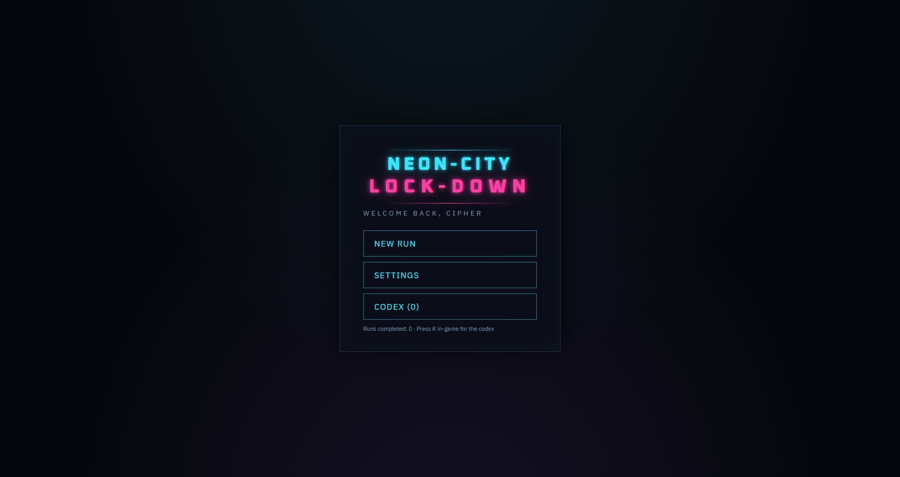
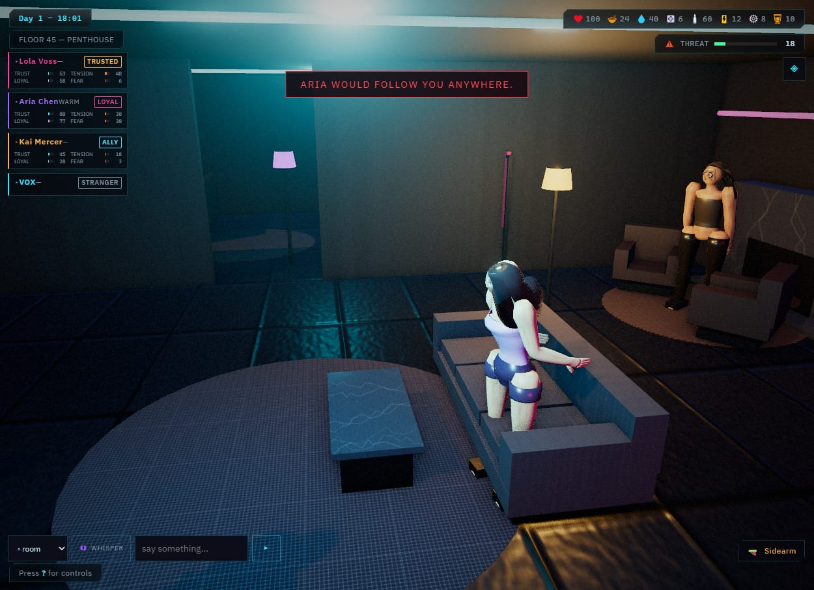
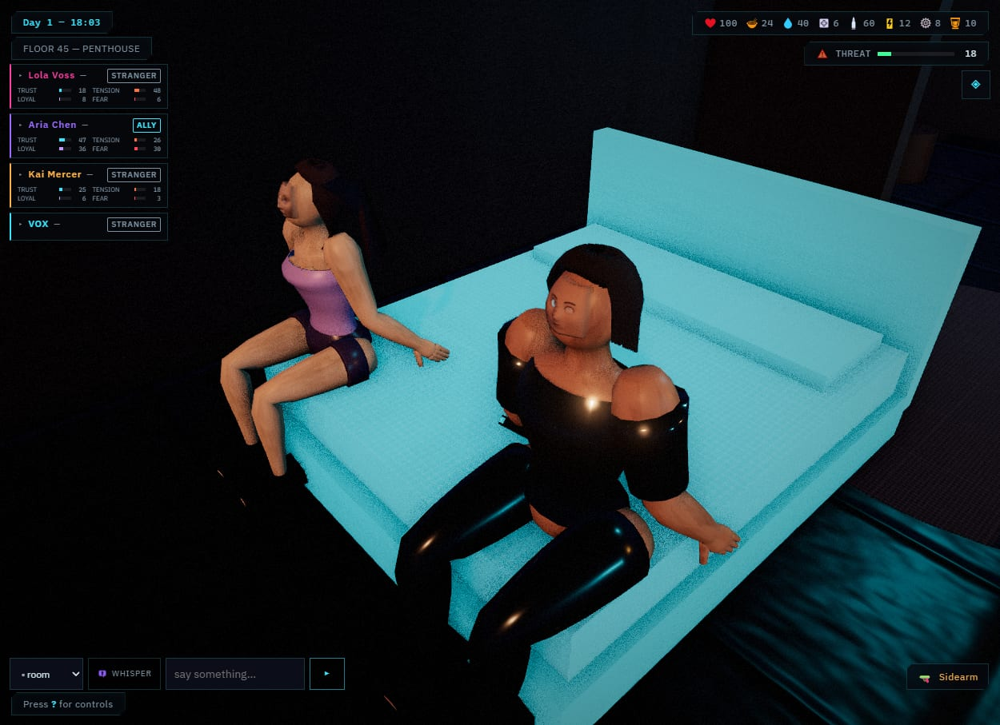
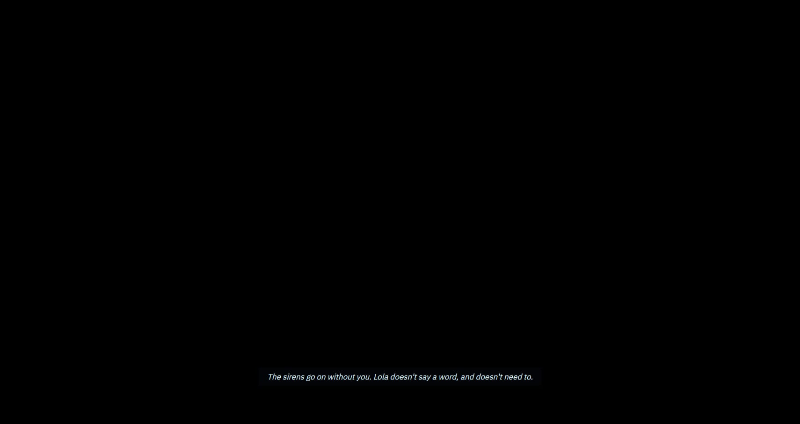

<h1 align="center">NEON-CITY: LOCK-DOWN</h1>

<p align="center"><em>an all-audiences neon-noir 3D roleplay + survival game</em></p>

<p align="center">
  <a href="https://github.com/nihilistau/neon-city-lock-down/releases/tag/v0.6.0-rc.1"></a>
  <a href="https://github.com/nihilistau/neon-city-lock-down/actions/workflows/ci.yml"></a>
</p>

<blockquote align="center">
🎉 <b><a href="https://github.com/nihilistau/neon-city-lock-down/releases/tag/v0.6.0-rc.1">v0.6.0-rc.1 — Nothing left behind</a></b> is out.<br>
0.6 turns Lock-Down into an <b>all-audiences survival game</b> — sub-project 1 of a
7-part upgrade. The old relationship-escalation systems are gone; in their place
a <b>bond tier</b> (stranger → ally → trusted → loyal) gates
companion trust, and the bed is ordinary furniture you can sit, lie on, and share
with a trusted ally.
<a href="https://github.com/nihilistau/neon-city-lock-down/CHANGELOG.md">Changelog →</a>
</blockquote>

<p align="center">
  
</p>

Neon-City is in lockdown. Riots, police, military, and faction wars tear the
streets apart below while three dangerous acquaintances — and you — are sealed
inside a luxury penthouse tower for days. Talk to them. Play them against each
other. Ration the food and the ammo. Repair the systems. Survive the nights,
however they play out — mind-games, alliances, or violence.

The tower itself is awake: **VOX**, an advanced building intelligence with cameras
for eyes and doors for hands, watches everything and is quietly starved for
conversation that isn't a maintenance request.

Everything here — geometry, textures, music, sound effects, UI — is **procedurally
generated or hand-authored**. The only third-party runtime dependency is three.js
(vendored, no build step). Character voices are baked with a local
[voxtral](https://huggingface.co/mistralai/Voxtral-4B-TTS-2603) text-to-speech model.

> **All-audiences.** Noir themes, strong language, and survival violence.
> No sexual content.

---

## The cast

| | Character | Archetype |
|---|---|---|
| 🔴 | **Lola Voss** | Bold, dominant. A renowned fixer — one of the toughest in the city. Walked in to collect a debt the night the gates fell. |
| 🟣 | **Aria Chen** | Shy → playful. A corporate negotiator who smoothed scandals for executives with too much money; her nerves lose to her curiosity. Everyone assumes she's fragile; everyone is wrong. |
| 🟡 | **Kai Mercer** | Enigmatic, charming, patient. An information broker who watches everything and is loyal only to the most interesting outcome. |
| 🔵 | **VOX** | The tower, awake. Sixty floors of sensors and three decades of uptime made it something more than a concierge. |
| — | **You** | A legendary freelance hacker/fixer. A myth. Name, pronouns, and look are yours to set on New Run. |

---

## Screenshots

<table>
  <tr>
    <td width="50%"><br><sub><b>New run</b> — pick a scenario and a loadout, continue the autosave, or open the codex.</sub></td>
    <td width="50%"><br><sub><b>Cinematic cutscenes</b> — camera-spline flights, letterbox, voiced + subtitled dialogue.</sub></td>
  </tr>
  <tr>
    <td><br><sub><b>Neon-noir penthouse</b> — procedural geometry, textures, bloom, and a live city burning through the glass.</sub></td>
    <td><br><sub><b>The living tower</b> — news tickers, world events, and branching choices with real consequences.</sub></td>
  </tr>
  <tr>
    <td><br><sub><b>Autonomous cast</b> — 9 stats each, moods, memory, in-fighting, and 8 outfit states.</sub></td>
    <td><br><sub><b>Director panel</b> — 8 tabs to stage scenes, launch scenarios, whisper, and tune the world.</sub></td>
  </tr>
  <tr>
    <td><br><sub><b>Bonds</b> — stranger → ally → trusted → loyal, derived from trust + loyalty; a toast when one deepens.</sub></td>
    <td><br><sub><b>The bed is furniture</b> — sit, lie down, and invite an ally to sit beside you.</sub></td>
  </tr>
  <tr>
    <td><br><sub><b>Stay the night</b> — a trusted companion stays: a fade, one line, three hours, both of you rested.</sub></td>
    <td><br><sub><b>Combat</b> — riots spill inside; hostiles breach the floor and the cast fights back.</sub></td>
  </tr>
  <tr>
    <td><br><sub><b>Perma-death & endings</b> — survive to the extraction, or don't. A run summary either way.</sub></td>
    <td></td>
  </tr>
</table>

<sub>Every image is captured from the running game by <code>node tools/screenshots.mjs</code> — see <a href="docs/development.md">docs/development.md</a>.</sub>

---

## Features

- **Chat-first roleplay.** Type freely to any character or the whole room; they
  reply in character and act autonomously when idle. A fully offline dialogue
  engine (keyword/intent parser, topic graph, mood-reactive line variants,
  per-character memory, tone side-effects, fallback ladders) drives it — with an
  **optional LLM adapter** that only restyles surface text while the game's
  stat/bond systems stay authoritative.
- **Living stage directions.** Every authored line can carry inline
  `[[stage:directions]]` that drive animation, facial expression, movement between
  rooms, lighting, camera, and sound as the text reveals.
- **Emotion & bonds.** 9 stats per character (happiness, openness, dominance,
  trust, tension, energy, sobriety, loyalty, fear), a derived mood, compliance
  scoring, and a **bond tier** (`stranger → ally → trusted → loyal`, derived from
  trust + loyalty with hysteresis so it never flickers) that gates how far a
  companion's trust in you reaches — from a private conversation to inviting you
  to sit with them.
- **Procedural 3D everything.** Stylized humanoids on programmatic 31-bone
  skeletons with parametric skinning, physically-shaded skin (sheen) and hair
  (anisotropic clearcoat), canvas + 3D-eye face rigs, and a layered animator
  (procedural gait, pose clips, additive breathing, gaze). 14 zones across 7
  floors, elevator transit, 10 lighting presets, time-of-day, a procedural city
  backdrop, rain, news-ticker monitors, and **openable velvet curtains** that draw
  across the glass to shut out the city.
- **New-game flow & roguelike.** A main menu picks from 15 scenarios (three earned by play) and 3
  starting loadouts (Fixer / Survivor / Gunhand), continues an autosave, or opens
  the codex. Day/night ticks, rationing, a resource economy, system damage &
  repair, **28 world events** plus a scheduled extraction endgame (shuttle seats
  or stay), perma-death with a run summary, and light meta-progression (a codex
  of discovered lore + run history).
- **Combat as a mode.** Breaches arrive in **waves** with a combat HUD (hostile
  hp bars, live hit-chance, wave countdown). Furniture is real **cover** — it
  cuts incoming hit chance for you, the cast, and hostiles alike; the cast
  sprints to cover and fights crouched, mercs advance to cover at mid-range
  while rioters rush. The building fights back: a **ceiling turret** auto-fires
  while the defence grid holds (and wears it down), and **blast shutters** can
  be dropped mid-fight (2 power cells) to seal out un-spawned reinforcement
  waves. Wins strip the fallen for ammo and gear; injuries are treated at the
  medbay.
- **Inventory & items.** A carried inventory (press **I**) of weapons,
  consumables, valuables, and key items. Equip a weapon and combat uses it
  (ranged spend ammo, melee need reach); use medkits, stims, rations, whiskey, and
  a signal jammer; loot the armoury, med cabinet, and crates for real gear.
- **Games, mind-games & the bed.** A card game, 3 mystery cases with clue
  discovery, interrogation and accusation, and 6 conversational gambits resolved
  on dice. The bed is ordinary furniture — sit, lie down, invite an ally to join
  you, or ask a trusted companion to stay the night (implied only: a fade, one
  narration line, nothing shown).
- **Generative audio.** A WebAudio bus graph with voice ducking, a music
  conductor whose mood matrix reacts to threat, combat, and calm, 12 synth SFX,
  per-zone ambience beds, VOX's formant/ring-mod voice, and **26 baked character
  voice lines** (plus an optional live TTS sidecar for un-baked lines).
- **Cinematics & a Director panel.** Camera-spline cutscenes with letterbox and
  subtitles; an 8-tab director console to stage lighting, cast, dialogue,
  actions, 15 scenarios, the world, games, and settings.
- **Save/load & easter eggs.** Multiple save slots + autosave (deleted on death),
  JSON export and import, a playable bar synth, a
  fish tank that dies in long blackouts, a balcony telescope, VOX growing fond of
  you across nights, and a Konami-code maintenance-shaft stash.

---

## Download, install & play

### Requirements
- **A modern desktop browser** with WebGL2 + WebAudio (recent Chrome, Edge, or
  Firefox). A discrete GPU is nice but not required — the scene is deliberately
  light (~33k triangles).
- **[Node.js](https://nodejs.org) 18 or newer** — only to run the tiny static file
  server (no npm install, no build step, zero runtime dependencies). Running the
  unit suites (`npm test`) needs **Node 20+**, where the built-in test runner is
  stable.

### Get it running
```bash
git clone https://github.com/nihilistau/neon-city-lock-down.git
cd neon-city-lock-down
node tools/serve.mjs 8420        # or double-click run.bat on Windows
```
Open **http://localhost:8420**, set your handle on New Run, and enter the tower.

### Optional — live voice + the Voice Controls panel (V)
The Voxtral TTS fork is vendored under `third_party/voxtral/` (source only). Build it +
fetch the model, then run the voice server:
```bash
pwsh scripts/voice/setup-voxtral.ps1     # build + download (or -From an existing build)
node tools/sidecar.mjs                    # voice server (port from config/voice.yaml)
```
Then press **V** in-game for realtime TTS, the voice library, long-text synthesis, custom-line
baking, per-character voice assignment, and cloning. See [docs/systems/voice.md](docs/systems/voice.md).

### Optional — LLM-rewritten / authored dialogue
Point LM Studio (or any OpenAI-compatible endpoint) in the **LLM Engine panel (L)**; every knob is
tunable there and in `config/llm.yaml`. The authored stat/bond machinery stays in charge.

If your LM Studio instance requires auth, supply the credential one of two ways — **never commit
it** (`lmstudio-api-key*.txt` is gitignored):
```bash
cp lmstudio-api-key.example.txt lmstudio-api-key.txt   # then paste sk-lm-<id>:<passkey>
# ── or ──
export LMS_API_TOKEN=sk-lm-<id>:<passkey>
```
Both paths fail soft: with no credential the game still boots and simply runs LLM-off.

### Make it yours — the Creation Kit
Almost everything is editable. Tune the engine in documented `config/*.yaml`
([docs/config](docs/config/README.md)); author your own **scenarios, events, cutscenes, and
dialogue** in the **Creation Kit panel (G)**, saved under `user/`. Nothing you make can break the
base game. Full guide: [docs/creation-kit](docs/creation-kit/README.md).

---

## Controls

| Input | Action |
|---|---|
| Type + **Enter** | Speak to the room or a named character (addressee dropdown, bottom-left) |
| **C** | Cycle camera: cinematic auto-director → third-person (over-shoulder) → first-person → free orbit |
| **WASD** / mouselook | Move the player avatar + aim (first / third person) |
| **LMB** / **R** | Fire weapon / reload (in combat) · **Space** context action |
| **F** | Cycle camera focus between the cast (orbit mode) |
| **E** / click | Interact with props (bar synth, telescope, fireplace, curtains, VOX terminal, loot, the bed…) |
| **E** on the bed | Sit → lie down → get up (also **W**/**A**/**S**/**D** while seated) |
| **P** | Day plan — spend action points (repair, fortify, forage, drill, rest, deal) + objectives |
| **`** (backtick) | Director panel (8 tabs) · **L** — LLM engine panel · **V** — Voice controls · **G** — Creation Kit (author scenarios, events, cutscenes, dialogue) |
| **I** | Inventory · **K** — codex · **Esc** — save/load menu |
| **Space** | Skip the current cutscene line |

The situational **auto-camera** frames combat, dialogue, and events on its own; any manual mode takes
over instantly. Toggle it and mouse sensitivity in **Director → Settings**.

📖 **Engine documentation** lives in [`docs/`](docs/README.md) — architecture overview, per-system
API references, the gameplay loop, and the event catalog.

---

## Development

```bash
npm test                              # node --test — 248 unit tests (stats, bond, dialogue, combat, sim…)
npm run test:e2e                      # playwright — 10 end-to-end tests in a real headless browser
npm run test:all                      # unit + linters + e2e
node tools/lint-data.mjs              # validate all content modules + cross-references
node tools/lint-config.mjs            # validate config/*.yaml against data/configSchema.js
node tools/bake-tts.mjs               # (re)bake voice lines via the voxtral CLI (incremental by hash)
node tools/screenshots.mjs            # regenerate docs/screenshots/ from the running game
```

No bundler. Plain ES modules + an import map; `vendor/three.module.js` is the only
vendored library. Content lives in `data/` as validated ES modules; engine code
in `src/` as many small focused modules.

**Continuous integration.** Every push to `master` and `overhaul/**`, and every
pull request into `master`, runs unit tests + lint on ubuntu-latest/Node 24
(`.github/workflows/ci.yml`). The Playwright e2e suite runs on pull requests
into `master` and on manual dispatch, uploading `test-results/` on failure.

<details>
<summary><b>Project layout</b></summary>

```
index.html            importmap + UI mounts
src/core/             loop, bus, clock, rng, settings, save, script interpreter, config (YAML), userContent
src/sim/              world tick, survival, threat, events, scheduler, combat, AI brains, bedScene, relationships
src/chars/            stats, bond, mood, memory, wardrobe (pure logic) + Character aggregate
src/dialogue/         normalize/intents/tone parser, topic graph, selector, effects,
                      stage directions, engine, LLM adapter, TTS router
src/scene3d/          stage, zone/furniture builders, procedural materials, lighting, monitors, post-FX
src/humanoid/         skeleton, body/outfit builders, face rig, animator, gait
src/audio/            engine, music (theory/conductor/instruments/sequencer), sfx, ambience, voice, sidecar
src/games/            cards, gambits, mystery
src/ui/               HUD, chat, stat bars, director panel + 8 tabs, games, codex, elevator
src/camera/           camera rig, first-person, director orbit, cinematic
src/cutscene/         cutscene player (timeline over the shared script interpreter)
data/                 cast, dialogue packs, zones, events, scenarios, outfits, poses,
                      games, cutscenes, news, voice script — all validated at import
                      configDefaults/configSchema/lightingPresets (the engine-config source)
config/               editable engine tuning per group — camera, combat, sim, chars, humanoid,
                      world, lighting, llm, render, voice (docs/config/)
user/                 your authored scenarios/events/cutscenes/dialogue + saved voices (gitignored)
tools/                serve (+ configApi/userApi/gameEngine/llmProxy), serverConfig, sidecar (voice
                      server), bake-tts, lint-data, lint-config
scripts/voice/        setup-voxtral, clone_voice.py (voice-cloning add-on)
third_party/voxtral/  vendored Voxtral TTS fork — source (binary + 2.7GB weights gitignored)
test/                 node --test unit suites + a headless smoke contract
```
</details>

### Architecture notes
- **The ActorQueue is the single command spine.** Every character
  movement/pose/expression — from AI, dialogue stage-directions, events,
  cutscenes, or the director — routes through one per-character queue. A command
  can carry a `minBond` requirement, refused at the queue if the character's
  current bond tier doesn't reach it.
- **`src/chars/bond.js` is the sole authority** on the bond tier, derived from
  trust + loyalty with hysteresis so a character's tier can't flicker line to
  line. Nothing stores a tier as truth; it's always recomputed from the stats.
- **The bus is the only cross-layer channel** (UI ↔ sim ↔ 3D); the composition
  root (`src/core/app.js`) is the one module that wires everything together.
- **`src/sim/bedScene.js`** owns the bed as a small state machine (player
  sitting/lying/none, seated guests), port-injected into `app.js` rather than
  reaching into the sim or scene graph directly.

---

## Content note
Neon-City: Lock-Down is an all-audiences survival game. It has noir themes,
strong language, and survival violence — riots, gunfights, injury, and
perma-death. There is no sexual content and no age gate. A **bond tier**
(stranger → ally → trusted → loyal), derived from trust
and loyalty, governs how far a companion's trust in you reaches: a private
conversation, an invitation to sit together, or — at the highest tier — asking
them to stay the night, which is implied only (a fade to black and one
narration line; nothing shown).

## Roadmap
0.6 is the first of seven planned sub-projects that take Lock-Down from its
v0.5 base toward a full AAA-style overhaul:

1. **Content cleanse + bonds** (v0.6, at rc.1) — strip out the old mature-content
   systems and replace them with the bond tier.
2. Asset pipeline + render quality
3. GLTF characters
4. Survival/lockdown loop
5. Combat and stealth
6. Story and exploration
7. UI / AAA polish

## License
Original work. All geometry, audio and UI are procedurally generated or
hand-authored for this project. The 23 committed image assets (character face
underpaints, HUD icons, fabric detail maps, the city plates) were generated for
this project via the xAI image API and processed by `tools/gen-art.mjs`; every
one has its prompt and processing recorded in `tools/art/manifest.mjs`, so any
of them can be regenerated from source. Oxanium and IBM Plex Sans are vendored
under the SIL Open Font License. three.js is vendored under its MIT license.
