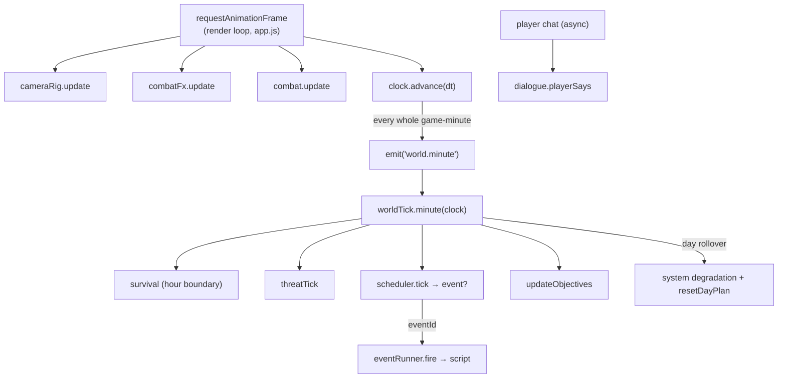

# Engine Overview

Neon-City: Lock-Down is a browser three.js game engine with a chat-first roleplay layer over a
survival roguelike day-loop, an authored-or-LLM dialogue engine, a procedural humanoid rig, a
situational camera director, and real FPS/TPS combat. No bundler: plain ES modules + an import map,
three.js vendored under `vendor/`, served by a ~60-line static server (`tools/serve.mjs`) that also
proxies the LLM engine.

## The composition root

`src/core/app.js` (`App`) is the only module that imports everything. It builds every subsystem,
wires their dependencies as **accessor closures** (e.g. `run: () => this.run`), subscribes to bus
topics, and runs the render loop. Nothing else reaches across layers directly.

## The four cadences



1. **Render loop** (`rAF`, `App.render`) — reads state, never mutates sim. Drives the camera,
   combat FX, combat controller, lighting, and the game clock. Default **1 real second = 1
   game-minute** (`src/core/clock.js`, `speed=1`).
2. **World tick** (`src/sim/tick.js`, once per game-minute) — survival on hour boundaries, threat,
   the event scheduler, objectives, and day-rollover bookkeeping (system degradation + AP reset).
3. **Event scripts** (`src/sim/eventRunner.js`) — an event's step-list runs asynchronously (can
   pause for player choices); the sim keeps ticking but the scheduler won't start another event.
4. **Dialogue turns** (`src/dialogue/engine.js`) — player-paced; async when the LLM agent answers.

## The event bus

`src/core/bus.js` — `on(topic, fn)`, `once`, `emit(topic, payload)`, `resetBus()`, and a `'*'`
wildcard. It is the **only** cross-layer channel. Representative topics:

| Domain | Topics |
|---|---|
| Time/world | `world.minute`, `day.started`, `threat.changed`, `resources.changed`, `systems.changed` |
| Combat | `combat.started/wave/waveIncoming/resolved/shutters/mag/hit`, `player.health` |
| Camera | `camera.mode` |
| Dialogue | `chat.player`, `chat.reply`, `voice.speaking/done`, `vox.speaking/done` |
| Intimacy | `bedgame.started/state/action/climax/withdraw/ended/talk`, `pose.paired/unpaired` |
| Events | `event.fired/done/choice`, `news.push`, `run.extraction` |
| Loop | `dayplan.reset`, `objective.done`, `char.stat/mood`, `run.death` |

Precedent: the **audio conductor** and the **camera director** both react to the same combat/
dialogue/intimacy topics — that is the intended pattern for any presentation layer.

## Architecture rules

- **The ActorQueue is the single writer** to a character's body. Every movement / pose / expression
  — from AI, dialogue stage-directions, events, or the director tools — is a command pushed to that
  character's `ActorQueue` (`src/sim/actors/actorQueue.js`). Gate-tier-tagged commands are checked
  at the queue, so content can't bypass consent.
- **`gates.js` is the sole intimacy authority** (`src/chars/gates.js`). Stat thresholds + in-fiction
  consent + the explicitness cap. Nothing else flips a gate.
- **The bus is the only cross-layer channel** (above).
- **Determinism where it matters**: seeded `RngStream`s (`src/core/rng.js`) drive sim/combat/dialogue
  selection; cosmetic FX may use `Math.random`.

## Directory map

```
src/core/     app.js (root), bus, loop, clock, rng, settings, save, log, script, types
src/sim/      world, tick, survival, threat, scheduler, eventRunner, death, meta, inventory,
              dayPlan, objectives; combat/{combat,resolver,cover}; ai/{brain,needs,…}; actors/{actorQueue,nav}
src/chars/    stats, gates, mood, memory, character, wardrobe
src/dialogue/ engine, parser/*, topics, selector, effects, stageDirections, llm/*
src/scene3d/  stage, lighting, postfx, picking, combatFx, monitors; tower/{zoneBuilder,furniture,curtains}
src/humanoid/ skeleton, bodyBuilder, outfitBuilder, face, animator, gait, clips, actor3d, pairedPoses
src/camera/   cameraRig, firstPerson (FP+TPS controller), cameraDirector
src/audio/    engine, music/*, sfx/*, voice, voxVoice, sidecar
src/ui/       hud, statBars, chatPanel, combatHud, reticle, planPanel, inventory, llmPanel, director/*
src/games/    bedGame, truthOrDare, gambits, mystery
data/         events, zones, scenarios, items, outfits, cast/*, dialogue/*, poses/*, games/*
tools/        serve.mjs (+ gameEngine/llmProxy), bake-tts, lint-data, sidecar
lmstudio-engine/  standalone LLM control module (own README)
```
