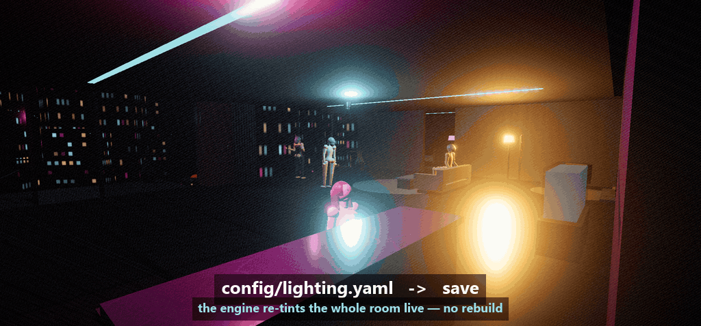
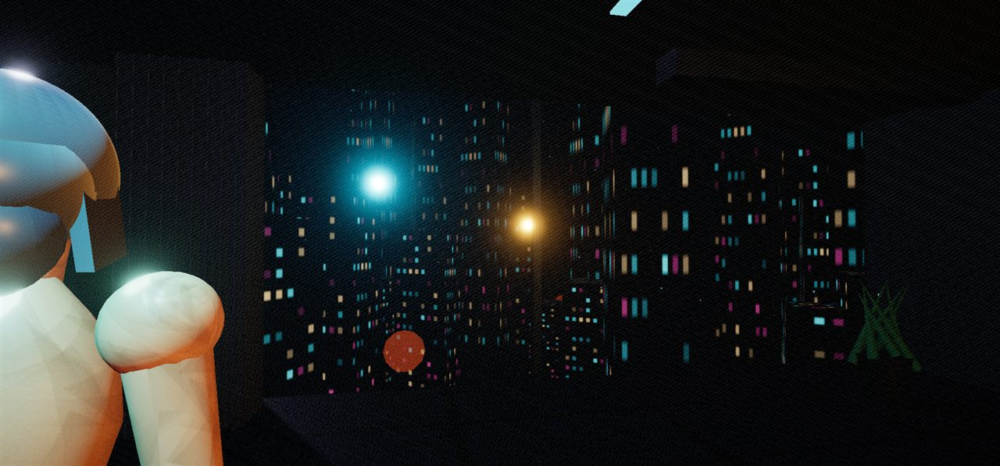
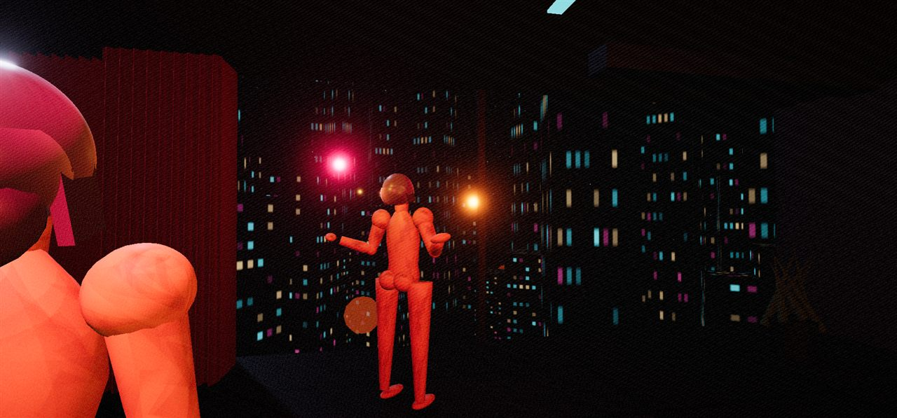
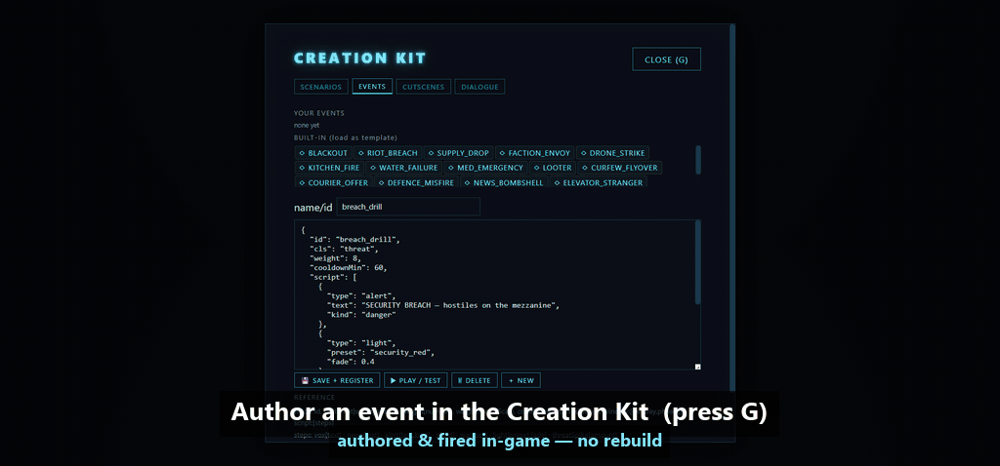
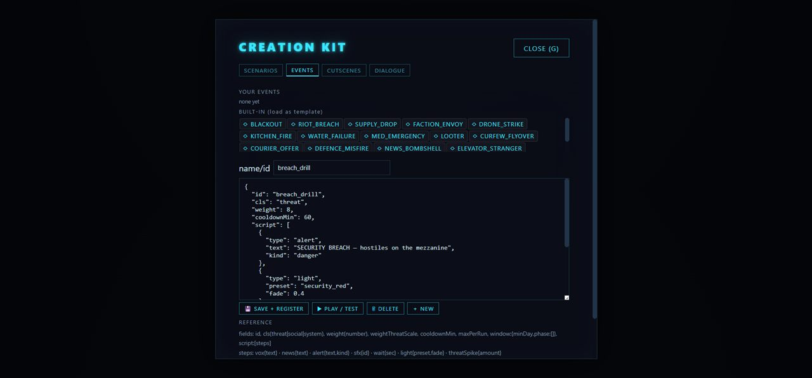
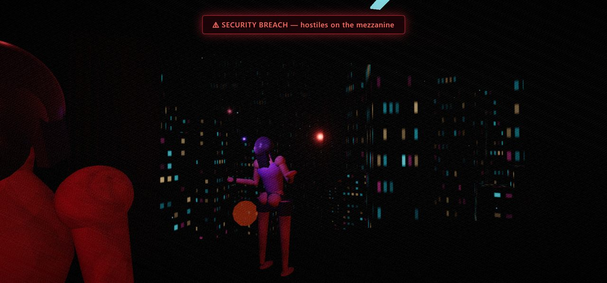

# v0.2.0 — GIF Storyboards (the two "wow" moments)

Capture plans for the two hero loops from the [demo script](../demo.md) — the moments that sell
"it's an **engine + creation kit**, not just a game" at a glance. Each is a short, silent,
auto-looping GIF built to read in a feed with no sound and no context.

Both map to beats already scripted in the [60-second social cut](../demo.md#60-second-social-cut-vertical-fast):

| GIF | Wow moment | Social-cut beat |
|-----|------------|-----------------|
| **#1** | Live lighting re-tint from a YAML edit | 0:03–0:15 |
| **#2** | Creation Kit event fires live in-game | 0:28–0:43 |

The frames below are **real captures** from the running build (down-scaled to 1280px), used here
as anchor keyframes — the start/end poses each GIF must hit.

---

## Shared capture spec

| Setting | Value | Why |
|---------|-------|-----|
| **Source resolution** | 1920×900 (16:9-ish game viewport) | Native canvas; crop later |
| **Export dimensions** | 1200×560 (landscape) · optional 1080×1080 square crop | GitHub/README width + social square |
| **Frame rate** | 24 fps capture → 18–20 fps GIF | Smooth pan, small file |
| **Duration** | 5–7 s per loop | Long enough to read the caption, short enough to autoplay-loop |
| **Loop** | Seamless (first frame ≈ last frame) | Feeds replay endlessly |
| **Target size** | ≤ 6 MB (README) · ≤ 15 MB (social) | GitHub inlines under ~10 MB |
| **Captions** | Burned-in, top or lower-third, high-contrast | Most feeds autoplay muted |
| **Palette** | Preserve neon cyan/magenta/red; `gifski` `--quality 90` | Neon banding is the aesthetic — don't crush it |

**Recording pipeline:** capture PNG frames (chrome-devtools `take_screenshot`, one per beat, or an
OBS/ScreenToGif screen grab of the canvas at 24 fps) → assemble → caption.

```bash
# Frames → high-quality GIF (best palette): ffmpeg extract, gifski assemble
ffmpeg -i capture.mp4 -vf "fps=24,scale=1200:-1:flags=lanczos" frames/%04d.png
gifski --fps 20 --quality 90 --width 1200 -o gif1_lighting.gif frames/*.png

# One-shot ffmpeg alternative (palettegen for clean neon):
ffmpeg -i capture.mp4 -vf "fps=20,scale=1200:-1:flags=lanczos,palettegen=stats_mode=diff" palette.png
ffmpeg -i capture.mp4 -i palette.png -lavfi "fps=20,scale=1200:-1:flags=lanczos,paletteuse=dither=bayer" gif1_lighting.gif
```

Add captions with the editor of choice, or burn them in ffmpeg (`drawtext`) as a final pass.

---

## GIF #1 — Live lighting re-tint

**The hook:** edit one hex value in a text file, reload, and the entire 3D scene re-lights. Proves
the whole engine is data-driven with no rebuild.

### ▶ Rough draft (real capture)



Captured from the running build, driven by the **real config path**: a warmed `neon_night` preset is
saved through the actual `saveConfigFile()` → `POST /api/config/lighting.yaml` (which writes the YAML
file *and* updates the live store), then the game's own `Lighting.apply('neon_night')` re-tints from
the edited config — no hand-lerp. The fade is deterministically stepped (`Lighting.update()` under a
stopped loop) for smooth frames, on a locked camera, assembled as a seamless ping-pong loop with
`ffmpeg` (1024×478, 12 fps, 2.9 MB). The core beat is genuine: **edit the YAML → the engine re-tints
the whole scene, no rebuild.** (The hero camera still favours the foreground figure; the distant
character stays shadowed at the warm end — a final pass would re-frame to keep both lit.)

**Loop length:** ~6 s. **Structure:** split-screen (YAML left ~40%, game right ~60%) *or* hard cut
from editor to game. Split-screen reads faster in a feed.

### Anchor frames

**A — before** (`config/lighting.yaml` shows `neon_night`; game is cold cyan-blue):



**B — after** (accent hex changed + saved + reloaded; the room is now hot red/orange):



### Beat sheet

| t (s) | Left (editor) | Right (game) | Caption | Capture action |
|-------|---------------|--------------|---------|----------------|
| 0.0–1.0 | `config/lighting.yaml` open on the `neon_night` block, cursor by the accent hex | **Frame A** — cold blue lounge, hold | `config/lighting.yaml` | Hold on A; 24 static frames |
| 1.0–2.0 | Select the hex, type a warm value (`#ff4a2a`) | Frame A, hold | *(typing visible)* | Screen-grab the keystrokes |
| 2.0–2.6 | Save flashes (Ctrl-S / "saved") | Frame A, hold | "edit · save" | 1 emphasis frame on save |
| 2.6–3.2 | — | **Reload** — brief black/flash | "reload" | The reload frame(s) |
| 3.2–4.6 | YAML still showing the new hex | **Frame B** blooms in — room shifts to red | "the whole scene re-tints — no rebuild" | Hold on B |
| 4.6–6.0 | — | Frame B, slow subtle idle (characters breathe) | "Every value is editable YAML" | Tail frames; loop back toward A tone |

**Seamless-loop trick:** end on a 0.3 s crossfade from B back to A so the loop "resets" the color
and replays cleanly, or just hard-cut — the before/after contrast is strong enough that a hard loop
still reads.

**Do-it-live (repro in the running build):**
1. `node tools/serve.mjs 8420`, open the game, Enter into the penthouse (lighting `neon_night`).
2. Edit `config/lighting.yaml` → `neon_night.accent` (and `key`) to a warm hex; save.
3. Reload the tab (or `POST /api/config/lighting.yaml` for a no-reload swap if wired).
4. Record A → edit → B. For the capture above, the re-tint was driven live via the lighting API.

---

## GIF #2 — Creation Kit event fires live

**The hook:** author a custom event as JSON inside the game, hit **Save + Register → Play**, and it
fires immediately — alert banner, the room snaps to red, the sim reacts. Proves the creation kit is
real and round-trips into the running world.

### ▶ Rough draft (real capture)



Two-phase story: the **Creation Kit** editor (the `breach_drill` JSON — note the `alert` + `light:
security_red` steps) hard-cuts to the game, where the **real event fires**. `breach_drill` is
registered into the live `EVENTS` registry (exactly what "Save + Register" does) and triggered via
`eventRunner.fire()` — driving the game's own `security_red` lighting fade and the real `#hud-alert`
banner ("SECURITY BREACH — HOSTILES ON THE MEZZANINE", the HUD's actual red uppercase styling). The
fade is deterministically stepped (`Lighting.update()` under a stopped loop) for smooth, evenly
spaced frames free of tab-throttling (1024×478, 10 fps, 2.1 MB). The beat lands: author JSON
in-game → the **real** event fires live, no rebuild.

> Capture liberties (for legibility, not fakery): the real banner is enlarged and its 0.3 s
> opacity fade slowed so it reads in a down-scaled GIF; the camera is locked and the sim paused so
> the shot isn't contaminated by other scheduled events. The trigger, the lighting, and the banner
> element/text are all the game's own.

**Loop length:** ~7 s. **Structure:** start on the **G** panel editor, cut to the game reacting.

### Anchor frames

**C — editor** (Creation Kit **Events** tab, a `breach_drill` event in the JSON editor):



**D — fired** (the event's payoff on-screen: red-alert banner + the room flashes `security_red`):



### Beat sheet

| t (s) | Screen | Caption | Capture action |
|-------|--------|---------|----------------|
| 0.0–1.5 | **Frame C** — Kit panel (**G**), Events tab, `breach_drill` JSON visible; cursor edits the `vox` line | "Author events as JSON — in-game" | Hold on C; show one small edit |
| 1.5–2.3 | Buttons highlight: **Save + Register** click | "Save + Register" | Emphasis frames on the click |
| 2.3–3.0 | **Play / Test** click; panel starts to dismiss | "Play" | The click + panel fade |
| 3.0–3.6 | Game view returns; brief beat of the calm lounge | — | Transition frames |
| 3.6–4.4 | **The event fires** — banner slams in, screen pushes toward red | *(let the banner speak)* | The trigger moment |
| 4.4–6.2 | **Frame D** — "⚠ SECURITY BREACH — hostiles on the mezzanine", room lit red, characters react | "…and it fires live in the running game" | Hold on D |
| 6.2–7.0 | Red pulses once, settles; tail | "No rebuild. It just runs." | Loop-out frames |

**Seamless-loop trick:** fade the red banner out over the last 0.5 s back toward the neutral lounge
so the loop returns to a calm state before repeating on Frame C.

**Do-it-live (repro in the running build):**
1. Press **G** → **Events** tab. Load/author an event (e.g. `breach_drill`) with a `light`
   step (`security_red`), a `vox`/alert line, and a `stat` effect.
2. **Save + Register**, then **Play / Test** (or `window.__ncld.debug.forceEvent('breach_drill')`).
3. The alert banner + `security_red` re-light are the payoff — hold there for Frame D.

> Capture note: in the reference grab, the event's transient FX had settled by screenshot time, so
> Frame D was re-staged (`lighting.apply('security_red')` + the alert HUD) to show the intended
> end-state. When recording for real, capture the actual `forceEvent` firing so the banner animates
> in on-camera.

---

## Delivery checklist

- [ ] GIF #1 `gif1_lighting.gif` — ≤ 6 MB, seamless loop, captions burned in
- [ ] GIF #2 `gif2_creationkit.gif` — ≤ 6 MB, seamless loop, captions burned in
- [ ] Square 1080×1080 crops for social (optional)
- [ ] Drop both into the [GitHub release](https://github.com/nihilistau/neon-city-lock-down/releases/tag/v0.2.0) body and/or the README banner
- [ ] Alt text on each (accessibility + feeds that don't autoplay)

**Lead with GIF #1** — the live re-tint is the single clearest "this is an engine" beat.
